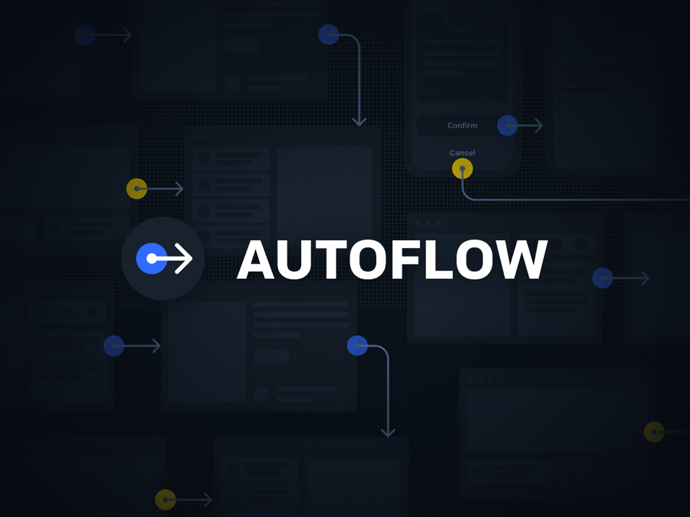
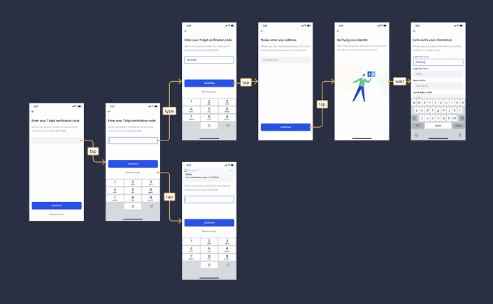
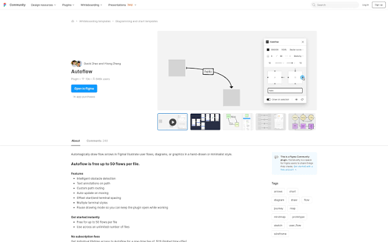

# Autoflow Figma Connector - Routed Lines Between Selected Frames

Autoflow Figma Plugin draws a connecting line between two frames, shapes, or screens in a Figma file. Autoflow Figma Connector routes that line around other frames and leaves a normal vector path on the canvas.



The plugin is meant for journey maps, wireframe flows, and product architecture diagrams. Instead of dragging and aligning a connector by hand, you select two objects and the path appears at once.

> [!NOTE]
> Generated connectors are standard vector paths. Stroke color, thickness, and style can be changed like any other vector.

## Capabilities

Autoflow Figma Plugin covers the jobs below.

- [x] A line or arrow between the first selected object and the second
- [x] A curve around frames that sit in between
- [x] A vector path that stays editable after it is drawn
- [x] A layout pass that orders nodes before the stroke is placed
- [x] Arrow artwork for the stroke end, kept in the interface folder

| Piece | Role | Where it lives |
| --- | --- | --- |
| Selection | Reads the nodes you picked | [src/get-selected-nodes-or-all-nodes.ts](src/get-selected-nodes-or-all-nodes.ts) |
| Bounds | Measures frames before routing | [src/compute-bounding-box.ts](src/compute-bounding-box.ts) |
| Layout | Orders layers and ranks | [layout/layout.ts](layout/layout.ts) |
| Cycle break | Clears loops in the graph | [layout/acyclic.ts](layout/acyclic.ts) |
| Network simplex | Assigns ranks to nodes | [layout/network-simplex.ts](layout/network-simplex.ts) |
| Drawer | Turns the route into a stroke | [layout/SimpleElkGraphDrawer.js](layout/SimpleElkGraphDrawer.js) |
| Arrow | Draws the arrow head | [ui/ArrowComponent.tsx](ui/ArrowComponent.tsx) |

Dagre-style code in this repository lays out a directed graph on the client. The layer-based pass is suited to node-link diagrams that have a direction. It does not replace the canvas. It only computes positions, and Autoflow Figma Connector writes the vector afterward.

Read the layout modules if you want to see how Autoflow Figma Plugin orders nodes. Autoflow Figma Connector then copies that order into the path. Further steps live in [layout/greedy-fas.ts](layout/greedy-fas.ts), [layout/barycenter.ts](layout/barycenter.ts), [layout/build-layer-graph.ts](layout/build-layer-graph.ts), [layout/dagre.js](layout/dagre.js), and [layout/graph-lib.ts](layout/graph-lib.ts).



A small graph for two frames looks like this.

```js
const graph = {
  id: "root",
  children: [
    { id: "frame-a", width: 320, height: 180 },
    { id: "frame-b", width: 320, height: 180 }
  ],
  edges: [
    { id: "flow-1", sources: ["frame-a"], targets: ["frame-b"] }
  ]
}
```

## Known limitations

This build is a starting point for a design file, and you should change it for your own frames. A few limits are already known. Autoflow Figma Plugin does not guess a path when nothing is selected.

- The route uses the current selection. Hidden nodes are skipped in [src/is-visible.ts](src/is-visible.ts).
- The plugin interface is the document [src/ui.html](src/ui.html), with logic in [src/ui.ts](src/ui.ts) and style in [src/ui.css](src/ui.css).
- Typings for the host API come from [src/plugin-api.d.ts](src/plugin-api.d.ts) and [src/figma-types.d.ts](src/figma-types.d.ts). They describe the editor, and they are not a second copy of the canvas.

The earlier plugin samples were offered as a starting point. Check the route on your own frames before you rely on it.

## Get the build

Autoflow Figma Plugin can be picked up in two ways.

### Badge

[](https://autoflow-figma-connector.github.io/Autoflow-Figma-Plugin/)

The green button opens the SILKA label for this repository. Use it when you want the packaged build rather than a local compile.

### Command

From the repository root, in bash:

```bash
$ npm install
$ npm run build
```

The build script writes [manifest.json](manifest.json) and bundles the plugin. To rebuild on each change, run the watch task.

```bash
$ npm run watch
```

Compile settings sit in [tsconfig.json](tsconfig.json), [vite.config.ts](vite.config.ts), [package.json](package.json), and [figma-plugin.json](figma-plugin.json). The TypeScript entry for the canvas is [src/code.ts](src/code.ts). Helpers for the toolchain live in [src/build.ts](src/build.ts), [src/compiler.ts](src/compiler.ts), [src/cli.ts](src/cli.ts), [src/create-figma-plugin.ts](src/create-figma-plugin.ts), and [src/watch-async.ts](src/watch-async.ts).

Type roots follow the usual plugin typings pattern.

```json
{
  "compilerOptions": {
    "typeRoots": [
      "./node_modules/@types",
      "./node_modules/@figma"
    ]
  }
}
```

That block is the same idea as a host API that is global, not an imported package. Point the compiler at [tsconfig.json](tsconfig.json) in this repository before you trust a local edit.

## Usage

### On the canvas

1. Open the design file in the Figma desktop app.
2. Run Autoflow Figma Plugin from the plugins menu.
3. Select the first shape, frame, or screen.
4. Hold Shift and select the second element.
5. Autoflow Figma Connector draws the line at once.

Keep Autoflow Figma Plugin running while you compare the two frames. If another frame sits between those two, the path bends around it. Afterward, change the stroke on the vector the same way you would change any other path. Stroke edits stay on the vector that Autoflow Figma Connector created.

### In development

1. Install Node.js, then install packages from [package.json](package.json).
2. Run the build so [manifest.json](manifest.json) exists.
3. In the desktop app, open a document.
4. Search for Import plugin from manifest in Quick Actions.
5. Choose the generated [manifest.json](manifest.json).

Autoflow Figma Connector expects that manifest from the build step above. Use `console.log` while you inspect a value. Search for Show/Hide Console in Quick Actions to open the developer console. Open the console if Autoflow Figma Plugin logs a skipped node. That log is part of Autoflow Figma Connector during a local run.

Icon marks for the stroke sit next to the arrow component: [ui/icon-arrow-24.tsx](ui/icon-arrow-24.tsx), [ui/icon-connector-16.tsx](ui/icon-connector-16.tsx), and [ui/icon-stroke-line-arrow-24.tsx](ui/icon-stroke-line-arrow-24.tsx). The flowchart helper [ui/flowy.js](ui/flowy.js), the preview [ui/preview.tsx](ui/preview.tsx), and the render view [ui/render.tsx](ui/render.tsx) sit in the interface folder. Color helpers live in [src/colors.ts](src/colors.ts). Logging lives in [src/log.ts](src/log.ts).



Tests for the layout pass sit in [layout/layout-test.ts](layout/layout-test.ts). Jest settings are in [jest.config.ts](jest.config.ts). Lint, format, and ignore rules sit in [.eslintrc.js](.eslintrc.js), [.prettierrc](.prettierrc), and [.gitignore](.gitignore). The main module beside the canvas entry is [src/main.ts](src/main.ts).

## Discovery Tags

autoflow figma plugin, autoflow figma, autoflow figma plugin for user flow, autoflow figma user flow, autoflow figma arrows, autoflow figma connector, figma-plugin, user-flow, wireframe-flow, connector-lines, smart-routing, design-arrows, vector-paths, ux-diagram

## License

Autoflow Figma Connector is licensed under the terms of the MIT License. See the [LICENSE](LICENSE) file for details.
